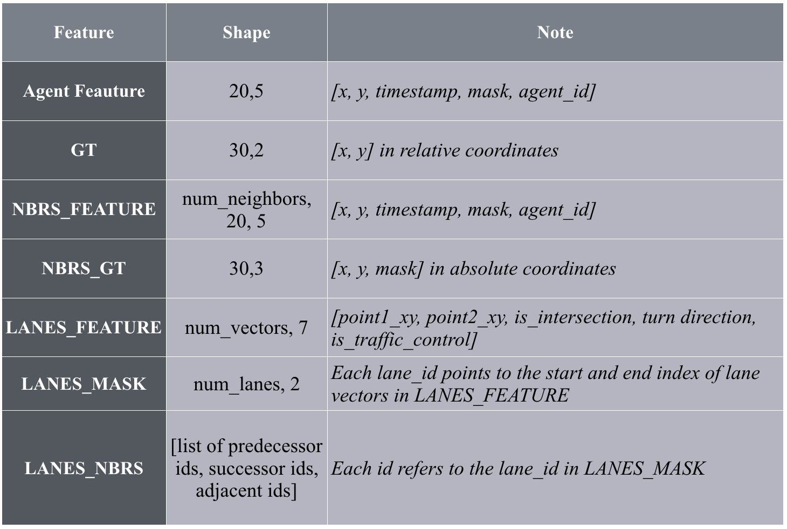

#  Code for Data Preprocessing of Argoverse Dataset
-> Also official data preprocessing for paper ["Multimodal Motion Prediction with Stacked Transformers. (CVPR 2021)"](https://github.com/decisionforce/mmTransformer)

-> The preprocessing code is modified from [this repository](https://github.com/xk-huang/yet-another-vectornet). Ensure the same dependencies.

## Usage

0) Install [Argoverse-api](https://github.com/argoai/argoverse-api/tree/master/argoverse). Download `HD-maps` in argoverse-api as instructed.

1) Prepare raw Argoverse dataset:
    
    Put all data (folders named `train/val/test` or a single folder `sample`) in `data` folder.
    
    An example folder structure:
    ```
    data - train - *.csv
         \        \ ...
          \
           \- val - *.csv
            \       \ ...
             \
              \- test - *.csv
                       \ ...
    ```
2) Modify the config file `utils/config.py`. Use the proper env paths and arguments.

3) Feature preprocessing, save intermediate data input features (compute_feature_module.py)
    ```
    $ python compute_feature_module.py
    ```
## Result Intermediate Data (Per Case)

Data format



## Note!

We do not do any data augumentation (e.g. rotation) here to normalize the scene. The preprocessing code is to derive informative intermediate data from Argoverse API (without any transform).
